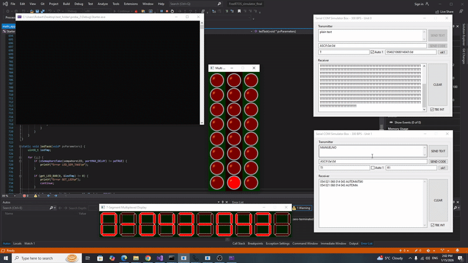
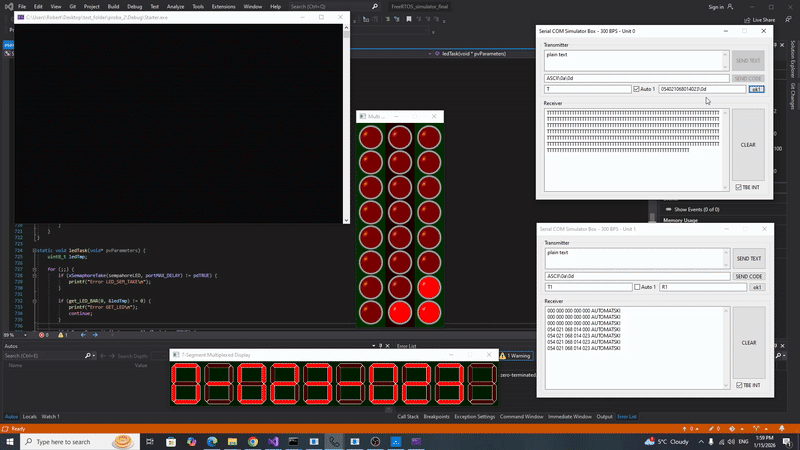
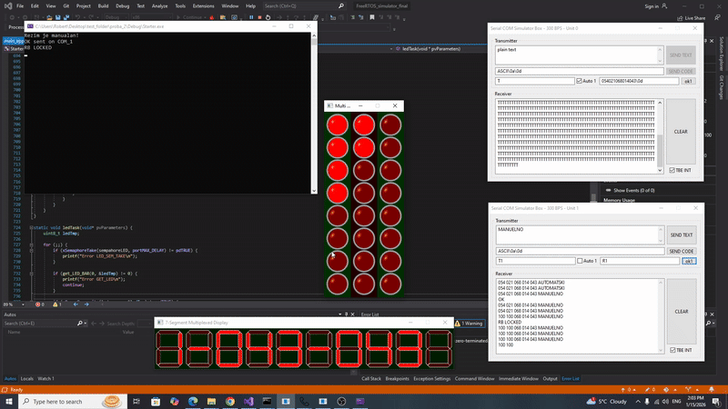

# Overview

This project demonstrates a timer-driven task scheduling system using FreeRTOS. The application implements periodic serial communication across two independent channels (COM0 and COM1) using software timers and semaphores to trigger tasks at different time intervals.

The system is used to control car windows and transmit information about their status.

The system illustrates how FreeRTOS timers can be used to control task execution timing, while semaphores provide synchronization between the timer callback and communication tasks.

The implementation was developed in a simulated embedded environment using serial communication and LED control modules.

## Main functionalities

- Automatic and manual operating modes
- Control of window raising/lowering level
- Monitoring of current, average, minimum, and maximum speed
- Speed limit detection
- LED bar used as input and output interface
- 7-segment display for status indication
- Serial communication (COM0 & COM1)

## System architecture

### Tasks

| Task | Functionality |
|-----|------|
| `prijemPorukaOdCOM0` | Receiving data from sensors |
| `prijemPorukaOdCOM1` | Receiving messages from user |
| `obradaPodataka` | Data processing |
| `ledTask` | LED interrupt |
| `message_COM_1` | Sistem status |
| `okTask` | Sending confirmation (`OK`) for COM1 |
| `windowRiseFall` | Car window status |
| `display` | 7-seg display control |

## Instructions for testing

To run the program, it is necessary to have Visual Studio installed and download the entire GitHub repository.
All required peripherals must be configured. The necessary peripheral software can be found in the Periferije folder.

For each peripheral, you need to:

  **1.** Open Command Prompt.
  
  **2.** Create a directory.

  **3.** Set the path to the folder where the corresponding peripheral software is located.

  **4.** After that, enter the software name and the appropriate arguments:
  
    - LED_bars_plus : rRr (Other colors can also be used, e.g., rBy. It is important that the letter case is respected.)
    - Seg7_Mux 10
    - AdvUniCom 0
    - AdvUniCom 1

Finally, start the program by clicking the Local Windows Debugger button in Visual Studio, and make sure the build configuration is set to x86 on the left side of the button.

**After the program starts, it is initially set to automatic mode.**

## 1️⃣ Automatic Mode
- On COM0, instead of T1, you need to enter the character T and set Auto = 1. Then, instead of R1, enter the sensor values in the following order:
  - rear right window
  - rear left window
  - front left window
  - front right window
  - current speed
- The allowed values for the windows are 0 to 100. If a value greater than 100 is entered, it will be ignored.
- Each message must end with \0d.

Example of a message : **054037054021099\0d**

- On COM1, every 5 seconds the following information is printed:
  - the values of all windows
  - the average speed (calculated from the last 10 samples)
  - the current operating mode

Example output on COM1:
054 058 099 010 054 AUTOMATIC

  

Initially, when the program starts, **the maximum car speed is set to 100**. Using the command **BRZINAXYZ**(XYZ are numbers) on COM1, it is possible to adjust the maximum speed. As long as the current speed > maximum speed, the value of all windows is set to 100.

  

If the command **NIVOXYZ**(XYZ are numbers) is entered on COM1, all window levels are adjusted. If a value greater than 100 is entered, that value will not be applied

## 2️⃣ Manuel mode

To switch to manual mode, the command **MANUAL** must be entered on COM1. After a successful transition, the message **OK** is printed on COM1. The same applies when switching from manual mode back to automatic mode.

In manual mode, the windows can be controlled using the first input LED bar, by using the lower input LEDs:

  

